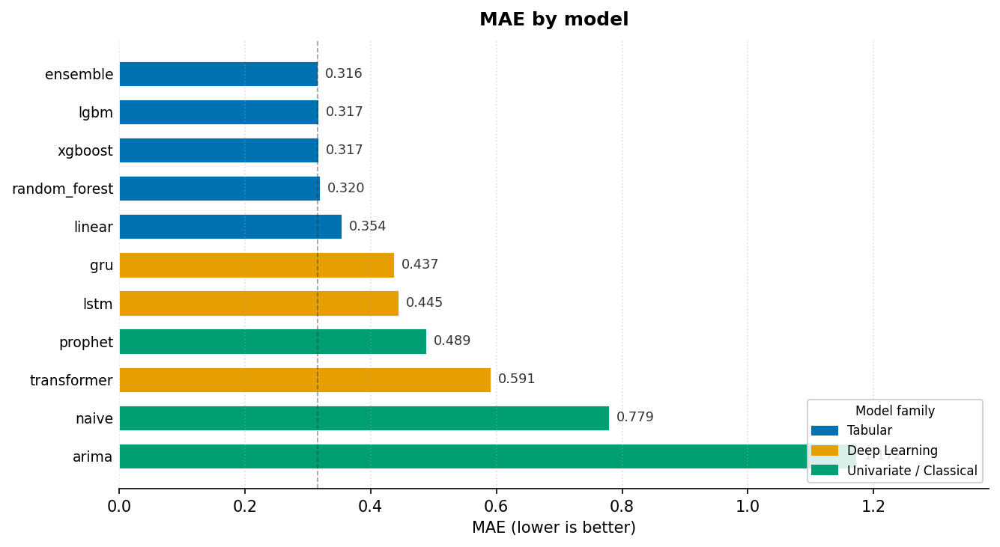

# Forecasting Showdown

A rigorous benchmark of 11 time-series forecasting models on hourly energy demand data — from a seasonal naive baseline to gradient-boosted trees, deep recurrent networks, and a stacking ensemble.

## Results

| Rank | Model | MAE | RMSE | Train (s) |
|---|---|---|---|---|
| 1 | **ensemble** | **0.3157** | 0.4595 | 4.0 |
| 2 | lgbm | 0.3165 | 0.4609 | 0.9 |
| 3 | xgboost | 0.3173 | 0.4610 | 0.4 |
| 4 | random_forest | 0.3196 | 0.4655 | 2.7 |
| 5 | linear | 0.3541 | 0.5040 | 0.004 |
| 6 | gru | 0.4371 | 0.5988 | 1788 |
| 7 | lstm | 0.4449 | 0.5886 | 170 |
| 8 | prophet | 0.4890 | 0.6405 | 2.9 |
| 9 | transformer | 0.5911 | 0.7503 | 423 |
| 10 | naive | 0.7792 | 1.0287 | 0.001 |
| 11 | arima | 1.1722 | 1.3277 | 72.9 |

See [`reports/report.md`](reports/report.md) for the full write-up with per-model interpretability notes and key findings.



## Dataset

[UCI Household Power Consumption](https://archive.ics.uci.edu/dataset/235/individual+household+electric+power+consumption) — resampled from 1-minute to hourly frequency, 2006-12-16 to 2010-11-26 (34 168 rows). Stored at `data/energy.csv`.

## Setup

Requires [uv](https://docs.astral.sh/uv/).

```bash
git clone https://github.com/<you>/forecasting-showdown
cd forecasting-showdown
uv sync --group dev        # install all dependencies including dev tools
```

## Running the benchmark

```bash
# All 11 models (spawns 3 isolated subprocesses — avoids macOS ARM libomp conflict)
uv run python scripts/run_all.py

# One model group
uv run python scripts/run_all.py --group tabular

# Single model
uv run python scripts/run_all.py --model lgbm

# View results in MLflow UI
uv run python -m mlflow ui
```

## Tests

```bash
# Default suite — 128 tests, tabular models only (no PyTorch / Prophet)
uv run pytest

# Deep learning tests (PyTorch — run separately on macOS ARM)
uv run pytest tests/test_base_seq.py tests/test_models_week3.py --override-ini="addopts="

# Prophet tests
uv run pytest tests/test_models_week4.py --override-ini="addopts="

# run_all.py orchestration tests
uv run pytest tests/test_run_all.py --override-ini="addopts="
```

## Notebooks

```bash
uv run jupyter notebook     # open notebooks/results.ipynb
```

`results.ipynb` reads MLflow runs and renders the comparison table, four charts, and a live forecast overlay for the top models. Run `scripts/run_all.py` at least once first.

## Repository structure

```
configs/          Model hyper-parameters (YAML, one file per model)
data/             energy.csv — hourly demand dataset
notebooks/        results.ipynb — interactive results viewer
reports/          report.md — final write-up; figures/ — saved charts
scripts/          run_all.py — full benchmark runner
src/
  config.py       load_config() — merges _base.yaml + model YAML
  data/           loader, feature engineering, splits, windowing
  evaluation/     metrics (MAE/RMSE/MAPE/SMAPE) + evaluate_model() runner
  models/         11 forecaster implementations + ForecasterBase ABCs
  visuals/        chart functions (mae_bar, metrics_grid, scatter, overlay)
tests/            128 unit + integration tests
```

## Models

| Family | Models |
|---|---|
| Univariate / Classical | Naive (seasonal), ARIMA/SARIMA, Prophet |
| Tabular | Linear/Ridge, Random Forest, XGBoost, LightGBM, Ensemble |
| Deep Learning | LSTM, GRU, Transformer |

## Key findings

1. **Tabular models dominate** — gradient-boosted trees outperform all deep learning models on this dataset thanks to effective lag/rolling/calendar features.
2. **Feature engineering > model complexity** — Ridge regression (12 features, < 1 ms) beats every deep model.
3. **Deep learning is expensive here** — GRU and LSTM train for 170–1 788 s to reach MAE 0.44, vs LightGBM at 0.9 s.
4. **Ensemble gain is marginal** — simple average of the top-3 tabular models improves MAE by 0.3% over solo LightGBM.
5. **Chronological splits matter** — all evaluations use strict 80/10/10 time-ordered splits; no shuffling.
